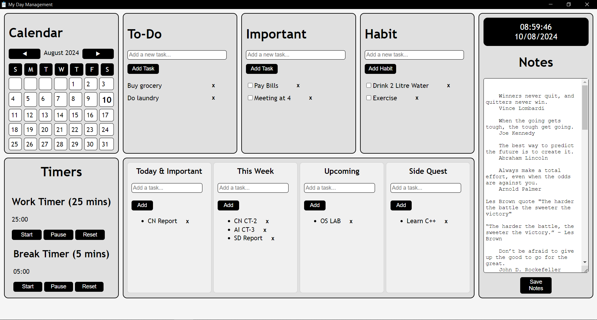

# My Life Management App

> This is a full functioning prototype. Currently at v1.0.0. If you have suggestions or improvements please send an email or open an issue on GitHub. Thank you!

## My Life Management App is a comprehensive, minimalist productivity tool designed to help you organize and streamline your daily tasks and long-term goals. Built with simplicity in mind, this application integrates various productivity methodologies and tools into an desktop app

---



## Features

- **Calendar**: Integrated calendar view.
- **To-Do List**: Organize your tasks with to-do list.
- **Important List**: Track important tasks.
- **Habit Tracker**: Develop and maintain positive habits by tracking.
- **Notes**: Keep all your thoughts, ideas, and information in one place.
- **Pomodoro Timer**: Boost your productivity with the Pomodoro technique.
- **Work tracker**: Prioritize your tasks using the work tracker.

## Download

**Download the Latest Windows (.exe) Release**:

- Visit the [Releases page](https://github.com/rayan2162/my-day-management-app/releases/tag/v_1.0.0) to download the latest version of the application.

## Installation

**Install from the source code.**

1. **Clone the Repository**:

    ```bash
    git clone https://github.com/rayan2162/my-day-management-app.git
    ```

    **Navigate to the Project Directory**:

    ```bash
    cd my-life-management-app
    ```

2. **Install Dependencies**:

    Make sure you have Node.js installed. Install the dependencies using:

    ```bash
    npm install
    ```

3. **Run the Application**:

    Start the application using Electron:

    ```bash
    npm start
    ```

## Create Package

For creating an installer or executable file, using electron-packager:

```bash
npm install electron-packager --save-dev
```

Package this app:

```bash
npx electron-packager . my-day-management-app --platform=win32 --arch=x64
```

This command creates a my-day-management-app-win32-x64 folder containing your packaged app.

## Create Installer

Using electron-builder (for more advanced options and auto-updating):

```bash
npm install electron-builder --save-dev
```

Add Build Scripts to `package.json`:

```json

"scripts": {
    "start": "electron .",
    "dist": "electron-builder"
},
"build": {
    "appId": "com.mydaymanagement.app",
    "productName": "My Day Management",
    "files": [
        "index.html",
        "styles.css",
        "script.js",
        "main.js",
        "preload.js",
        "alarm.mp3",
        "logo.ico"
    ]
}
```

Create Installer:

```bash
npm run dist
```

This command creates an installer or executable file for your platform.

## License

This project is licensed under the MIT License.

### Thank you for using My Life Management App
